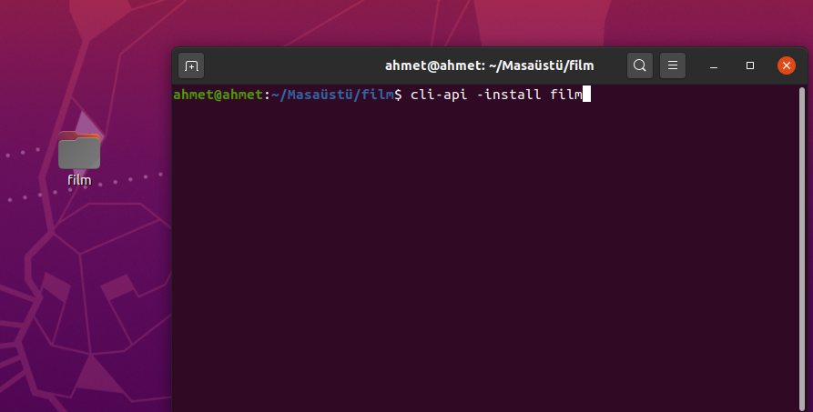
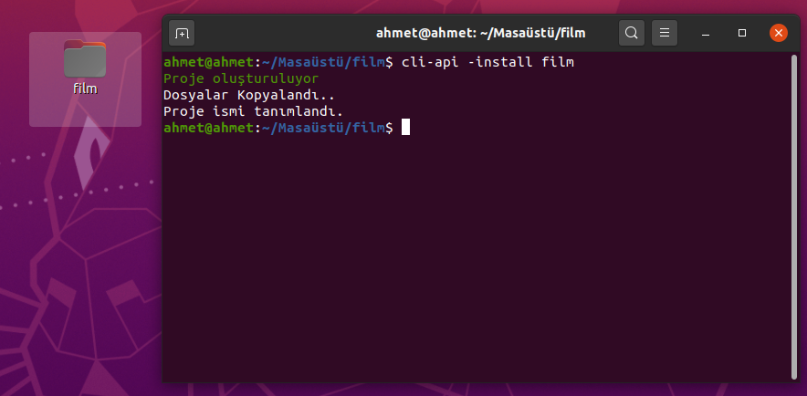
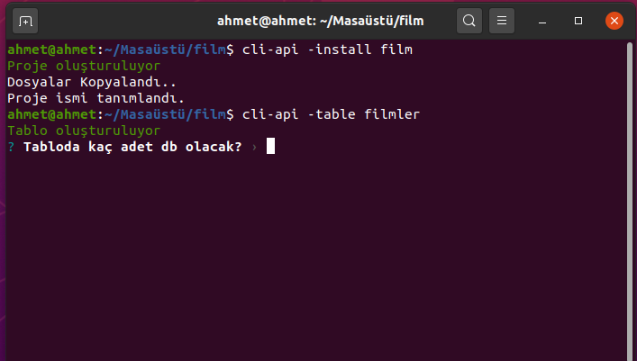
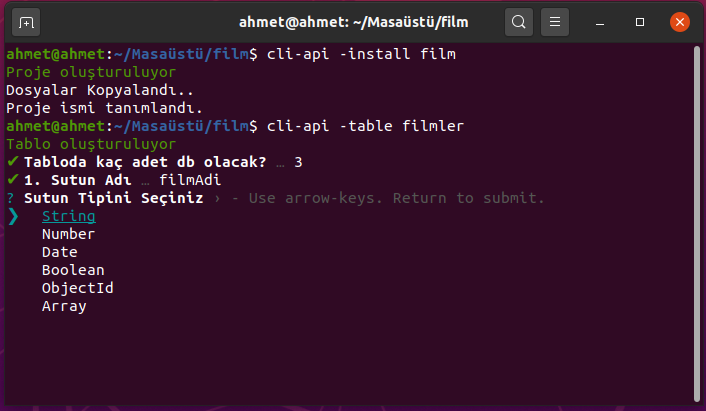
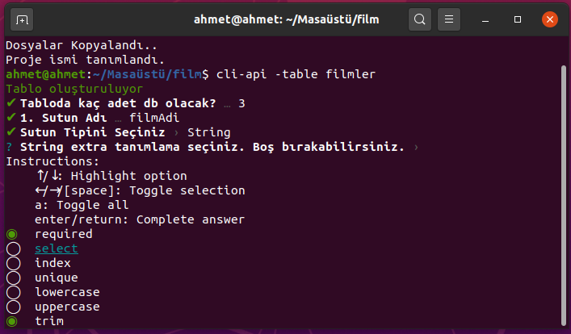

# cli-api
Hızlı bir şekilde api oluşturmanızı sağlayan nodejs paketi.

## kurulum
 * projeyi kulonlayın yada bilgisayarınıza indirin.
 * indirdiğiniz dosyayı ilgili dizinde terminalde başlatın
 * projeyi paket şeklinde kullanabilmeniz için globale kurmanız gerekir

linux
 > sudo npm i -g

 windows
 > npm i -g

Kurulum tamamlandıktan sonra terminale
> cli-api --version

Yazdığınız zaman versiyon numarasını almış iseniz paket kurulumu tamamlanmış demektir.

 * Herhangi bir yere bir dosya açın örneğin filmler isimli bir dosya
 * Dosyaya konumunu terminalden çalıştırın.
 * Terminalde yeni oluşturduğunuz dosyanın içinde olduğunuza emin olunuz. Gereksiz yere dosya oluşturulmasını istemezsiniz :D

## filmler apisi oluşturma
bir kac adımda token ile üye doğrulaması da dahil olmak üzere yakışıklı bir apiniz olacak arkanıza yaslanın. Gaza geldim abartıyorum :D

terminale aşağıdaki kodu yazınız
> cli-api -install film

film isimli apiniz oluşturuldu ancak henüz bitmedi. Sistem veritabanı olarak mongoDb kullanıyor doğal olarak bilgisayarınıza mongoDb veritabanını kurmanız gerekiyor. mongoDb veritabanınızda varsa projenizin isminde ki onu ben film olarka beilrledim bir db oluşturun.

## mongoDB ye tablo ekleyelim
tablo eklemek çok basit
> cli-api -table filmler

yukarıda filmer isminde bir tablo uluşturduk tabloda kaçtane sutun olacak ve sutunların özellikleri ne olacak gibi sorularıda cevapladıktan sonra apiniz hazır.  

## önemli
* port 3001 kullanıyor
* filme ekleyebilmek için önce üye olmanız gerekir. Adı film istediğiniz kadar tablo ekleyebilirsiniz.
* localhost:3001/public/register e bir post isteği ile username ve password gönderek üye olun.
* localhost:3001/public/register/login urline username ve password olacak şekilde post isteği ile giriş yapın ekrana token gelecek
* tokeni get, post yada vs. yöntemler ile apiye istekte bulunarak film örneği üzerinden gittik film ekletebilirsiniz.

## postmande film ekletebilmek için
 * token oluşturduktan sonra headere  x-access-token olarak oluşan tokeni ekleyiniz.
 * localhost:3001/api/film isteğine post gönderin ve film ekleyin
 * localhost:3001/api/film isteğine get gönderin ve filmleri çekin vs...

artık apinize post, get, delete vb. isteklerde bulunarak kullanabilirsiniz. Geliştirmeye devam edeceğim inşallah belki yakında dosya, resim vs. yüklenebilecek hale gelir :D
